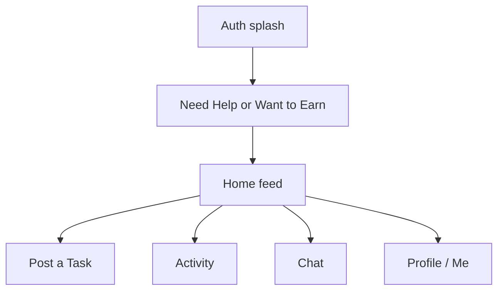
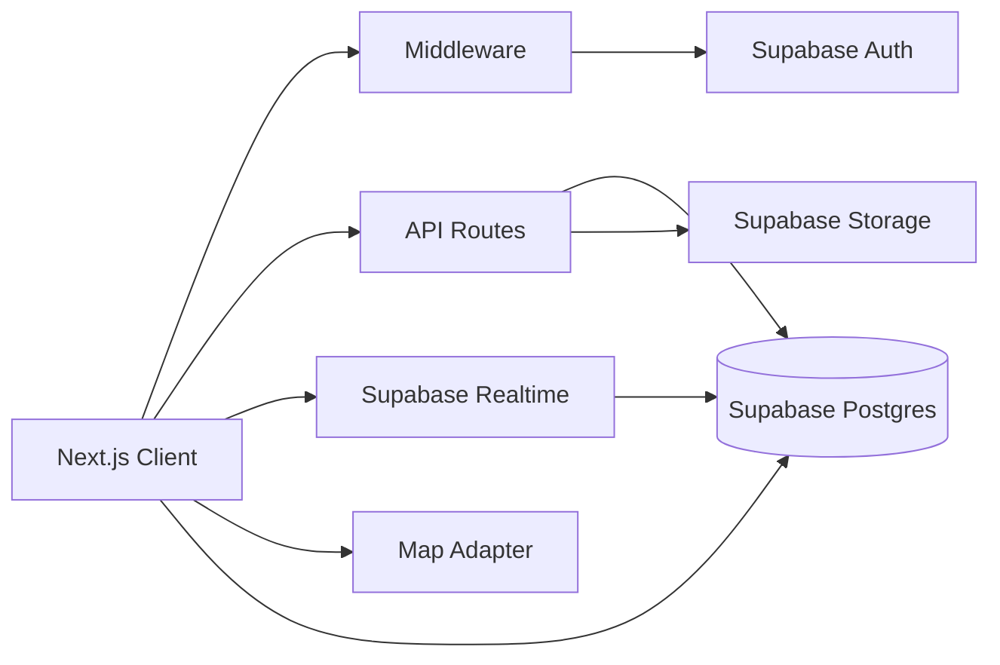

# NearTask Local Task Marketplace

Greenfield Next.js App Router app. **Supabase** for Auth, Postgres, Storage, Realtime. **No Prisma. No Auth.js.**

Brand: **NearTask** (easy to rename via [`lib/brand.ts`](lib/brand.ts)). Recreate the **UX and visual system** from the iPhone PWA screenshots. Do **not** copy the NearUs logo, handshake-pin mark, 3D character art, or wordmark.

**Locale (locked):** Afghanistan. UI in English for MVP. Currency **AFN (؋)**. Distances in **km**. Seed cities: Kabul, Herat, Mazar-i-Sharif, Kandahar, Jalalabad. Address fields: Area + Locality/District + City.

**Payments (locked):** **Cash only.** No wallet, UPI, cards, or transaction history. Task prices are informational. Helpers are paid in cash when the job is done. Profile shows a short “Cash on completion” note instead of a payments stack.

---

## Locked stack

- Next.js App Router, TypeScript, Tailwind, shadcn/ui, Lucide, TanStack Query, RHF, Zod
- Supabase Auth (email/password + Google), Postgres, Storage, Realtime
- `@supabase/ssr` + generated types + RLS
- Installable PWA (manifest + icons) so mobile matches “Add to Home Screen” usage
- Vercel + Supabase env vars
- Maps: Mapbox behind `lib/maps` (still the recommended default)

---

## Open decisions

1. **Maps:** Mapbox vs Google Maps. Recommended: Mapbox adapter.
2. **Google OAuth:** Enable in Supabase when credentials exist; Email still ships first.
3. **Supabase project:** New NearTask project (recommended).
4. **Dari / Pashto:** Not in MVP. English UI, Afghan places and AFN. i18n later.

---

## Visual source of truth (mobile)

The attached iPhone PWA screenshots are the **mobile UI spec**. Match layout, density, and interaction patterns. Use our own yellow token and NearTask branding.



### Design tokens (replace the old terracotta plan)

Inspired by the PWA, implemented as **our** tokens:

- **Primary yellow:** ~`#F5C400` (buttons, active chips, center Post FAB, selected category)
- **Yellow header:** full-bleed yellow with a **soft wavy bottom edge** on Chat, Activity, Profile
- **Page background:** light gray (`#F3F4F6`)
- **Cards:** white, ~16–24px radius, hairline gray border, almost no shadow
- **Text:** near-black headings, gray labels/subtitles
- **Secondary accent:** soft lavender only on the home promo banner
- **Danger:** muted red for Log Out / destructive
- **Pills:** fully rounded chips and CTAs
- **Type:** one clean sans (Geist / Inter). Do not use the screenshot’s leftover icon-font words (`arrow_forward`) — real Lucide icons.

**Do not** ship the 3D laptop character or handshake-pin logo. Use simple line illustrations / Lucide in yellow blobs, like the onboarding cards.

### Mobile chrome (every authenticated screen)

Floating **pill dock**, inset from the bottom, white, soft shadow:

1. Home
2. Activity
3. **Post** — large yellow circle, black `+`, slightly raised (primary action)
4. Chat
5. Me

Active tab: yellow icon + small yellow dot under the label. Unread: dot on Chat.

Safe-area padding for iPhone home indicator. Large tap targets.

### Screen-by-screen (mobile)

**Auth splash**

- Yellow upper half, white lower half, wavy divide
- NearTask wordmark (our logo, not NearUs)
- Floating sample task card (avatar, km away, AFN price badge, title, date/time, yellow arrow)
- Sticky: **Continue with Google** (solid yellow), **Continue with Email** (yellow outline)

**Onboarding**

- “What are you here to do?”
- Two white cards: **Need Help?** → Post a Task; **Want to Earn?** → Browse Tasks
- **Skip for now**
- Selecting a path sets a preference; users can still do both later
- Location permission happens on Home, not a separate forced screen

**Home**

- Left: yellow pin + current area (or “Location unavailable”)
- Right: notifications bell (no wallet icon — cash only)
- Pill search: “Search for tasks…” + filter
- Promo banner: post/earn message + simple illustration
- Horizontal category chips; **All** selected = yellow fill
- “Tasks near you” + refresh
- Task cards when location works; **location-denied empty state** with Fix/settings copy when it does not

**Post a Task — one scrolling form, not a 6-step wizard**

Stacked white cards:

- Title \* (min 5, max 120, counter)
- Description \* (min 10, max 2000, counter)
- Category \* — 4×2 icon grid, selected cell yellow
- Address \* — Area + Locality (Afghan district/neighborhood)
- Pricing \* — amount in ؋, single field (cash)
- Schedule (optional) — tap target → date/time sheet
- Visible radius — pills **2 km / 5 km / 10 km** (selected yellow)
- Location-blocked warning + **Fix** when GPS is off
- Sticky yellow **Post Task**

Categories (from the PWA, not the old Moving/Cleaning list):

Services, Rentals, Study, Fashion, Food, Tech, Errands, Other

**Activity**

- Wavy yellow header, “My Activity”
- Three stat cards: Tasks posted / Tasks accepted / Reviews
- Pill tabs: **Posted | Accepted | Completed**
- Empty state: illustration, heading, subcopy, yellow **+ Post a Task**
- Soft yellow “Looking to earn?” banner → Home/browse

**Chat**

- Wavy yellow header, “Chat”, compose icon
- Pill search “Search messages…”
- Empty: bubble icon, “No conversations yet”, **Browse Tasks**
- With data: avatar, name, last message, time, unread, task title in the thread header

**Me / Profile**

- Wavy yellow header, settings gear
- Avatar with yellow edit badge, name, star + review count, area/city
- Cream pill **Edit Profile**
- **No wallet / payment methods / transaction history**
- Instead: “PAYING FOR TASKS” card — Cash on completion, short safety copy
- Settings / Notifications / Privacy grouped list cards (icon + title + subtitle + chevron)
- Help Center / Contact Support
- Red **Log Out**

Task cards (login sample + feed):

- Requester avatar, distance in km, yellow **؋** price badge, bold title, date + time, optional category chip, offer count when relevant

---

## Desktop / web (not a stretched phone)

Mobile is primary. Desktop must still feel like a **fast, light website**, not an emulator.

- Breakpoints: mobile dock **&lt; 768px**; tablet tight; desktop **max-width ~1120px**, centered
- **No floating bottom dock on desktop.** Use a slim top bar: logo, search, Post, Chat, Activity, Me
- Home: promo + chips in one row; task grid **2–3 columns**
- Post Task: same fields, **two-column** (details | location/map) — still one page, not a wizard
- Activity / Chat: list + detail **side by side**
- Same yellow/cards/type. More whitespace, not a new theme
- Performance: CSS/SVG only (no 3D, no extra motion libs), RSC where possible, lazy maps, compressed images, small PWA shell

---

## Architecture

User-scoped Supabase client (`@supabase/ssr`) for almost all reads/writes. **RLS is authorization.** Service role only for seed and account deletion. API routes for multi-row mutations (accept offer, select helper, complete), still using the **user session**.

```
app/
  (auth)/                 # splash, email, callback
  (onboarding)/           # role picker
  (app)/
    page.tsx              # Home
    post/                 # Post a Task
    activity/             # My Activity
    chat/                 # list + [id]
    me/                   # Profile + settings
    tasks/[id]/           # detail / offers
    notifications/
  auth/callback/
  api/
lib/supabase/
supabase/migrations/
```



**Location privacy:** public cards show area + km, never street address. Exact address only after helper is selected (RLS on `formatted_address`).

---

## Auth (Supabase)

Cookie sessions via `@supabase/ssr`. Google + Email from the splash. Password reset via Supabase recovery. Middleware refreshes cookies. Signup trigger creates `profiles` (`id = auth.uid()`). Incomplete onboarding can Skip. Delete account: wipe storage, then `auth.admin.deleteUser`.

---

## Data model

`auth.users` + `public.profiles` (FK). Trust tables: `reports`, `blocks`.

Key task fields vs old plan:

- `budget_amount` (single cash amount, AFN) — drop flexible min/max for MVP to match the one-field Pricing UI
- `visibility_radius_km` (2 | 5 | 10)
- `area`, `locality`, `city` + private `formatted_address`
- `scheduled_at` nullable
- status: `open` | `offer_received` | `helper_selected` | `in_progress` | `completed` | `cancelled`

Offers, conversations, messages, reviews, notifications, saved_tasks unchanged in spirit.

Distance: Haversine SQL, filters **2 / 5 / 10 km**. Realtime on `messages`, `offers`, `notifications`, `tasks`.

**RLS:** own profile edits; marketplace read of public task fields; address only requester + selected helper; offers visible to helper + requester; chat only participants; notifications only recipient; blocked pairs excluded.

---

## Core product loop (unchanged)

POST → nearby discover → OFFER → SELECT helper → CHAT → COMPLETE → REVIEW

Offers UI can stay as a task-detail sheet (Accept / Decline / Chat). Chat is created when a helper is selected. No in-app money movement.

---

## API surface

Zod + `getUser()` + RLS. Human errors only.

- tasks CRUD, offers, select-helper, status
- conversations / messages
- reviews, notifications
- reports / blocks
- search
- signed Storage uploads

Push dispatcher stub later. Auth emails already come from Supabase.

---

## Seed and quality

Seed via service role: 10+ users, 20+ tasks around **Kabul and other Afghan cities**, AFN amounts, km distances, mixed statuses, offers, reviews, chats. Fictional names.

After each slice: `tsc --noEmit`, lint. Mobile screens must match the screenshot density before adding more features. Desktop: same flows, no layout breakage, keep JS light.

---

## What we will not copy

- NearUs logo, pin+handshake, wordmark, 3D characters, screenshots as assets
- UPI / wallet / INR copy from the PWA

We **will** match structure: yellow system, floating dock, wavy headers, card forms, two-path onboarding, cash-priced task cards.

---

## First sprint (after approval)

1. Scaffold Next.js PWA + tokens + floating shell
2. Supabase project, auth middleware
3. Migrations + Afghanistan seed
4. Splash, onboarding, Home, Post Task, Activity empty states
5. Visual review on iPhone-width and desktop before offers/chat
